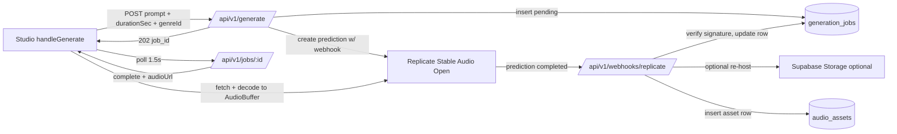

# Sonara PRD supplement v1.2 — Server-driven Music Generation

**Status:** Phase 4 engineering target (PRD only — no code lands with this document)
**Depends on:** Sonara PRD v1.0, Architecture doc, PRD v1.1 Publishing
**Audience:** Product, engineering, operators

## 1. Problem statement

Sonara's text-to-music generation runs **client-side** today via a procedural synthesiser in [`src/lib/ai/mock.ts`](src/lib/ai/mock.ts). That implementation is great for demos and CI but produces drum-machine pastiche, not real music. To make Studio actually useful as a "Generate from prompt" surface, we need to route generation through a **real text-to-music model** on the server, while preserving the offline / guest experience the mock provides today.

## 2. Goals

| ID | Goal |
|----|------|
| G1 | A signed-in user clicks **Generate** in Studio and receives audio rendered by a real text-to-music model (**Stable Audio Open** on **Replicate**), decoded into an `AudioBuffer` and added as a track. |
| G2 | Generation is **asynchronous**: the API returns a `job_id` immediately, Studio polls a job endpoint, and the heavy lifting happens out-of-process on Replicate with a webhook delivering completion. |
| G3 | Existing **mock provider** path stays usable when credentials or the database are absent (guest mode, CI, local prototyping). Switching providers is an env flip, not a code change. |
| G4 | **Spend is bounded:** per-request duration cap, per-user daily seconds cap, pinned model version. |

## 3. Non-goals (Phase 4)

These remain on the client mocks and are explicitly deferred to a future phase:

- Real **stem separation** (HTDemucs / Demucs via Replicate).
- Real **mastering** (FFmpeg `loudnorm` + limiter pipeline).
- Real **BPM / key analysis** beyond the procedural estimator.
- AI **auto-mix** and transition planning for the DJ console.
- **Object storage** migration for project save (project payloads still round-trip base64 WAVs via `src/lib/studio/projectSync.ts`).
- **Multi-track mixdown / bounce** for export.
- Server-side **background worker queue** (Replicate webhook + browser polling is sufficient at this scope; no Redis/BullMQ needed yet).
- New schema (this phase only reuses existing `audio_assets` and `generation_jobs` tables from Phase 2).

## 4. User stories

1. **Producer (signed in, credentials configured)** — I type "warm lo-fi piano loop, 90 bpm, jazz chords" into the Studio prompt box, pick a 24-second duration, and click **Generate**. The activity log shows "queued -> rendering on Replicate -> downloading -> decoded". A new track appears on the timeline with the generated audio.
2. **Operator (Phase 4 enabled in production)** — I set `AI_PROVIDER=replicate`, `REPLICATE_API_TOKEN`, `REPLICATE_STABLE_AUDIO_VERSION`, and `REPLICATE_WEBHOOK_SIGNING_SECRET`. I verify a single end-to-end generation succeeds and confirm `generation_jobs` and `audio_assets` rows populate.
3. **Guest / CI (no credentials)** — Studio still works exactly as today via [`src/lib/ai/mock.ts`](src/lib/ai/mock.ts). No backend dependency on Replicate or Postgres for the local prototype path.

## 5. Architecture



### 5.1 Component responsibilities

| Component | Role | Owns |
|-----------|------|------|
| [`src/app/api/v1/generate/route.ts`](src/app/api/v1/generate/route.ts) | Validate, authorise, rate-limit, create the job + Replicate prediction. | `generation_jobs` insert, Replicate `predictions.create`. |
| [`src/app/api/v1/jobs/[id]/route.ts`](src/app/api/v1/jobs/%5Bid%5D/route.ts) | Read-only job status hydration for the browser poll. | `generation_jobs` read, `audio_assets` lookup. |
| [`src/app/api/v1/webhooks/replicate/route.ts`](src/app/api/v1/webhooks/replicate/route.ts) | Verify Replicate signature, persist outputs, optionally re-host. | `generation_jobs` update, `audio_assets` insert, Supabase upload (optional). |
| `src/lib/ai/server/replicate.ts` (new) | Pure `fetch` wrapper around Replicate's `predictions` API. | Request shape, response typing, error mapping. |
| `src/lib/ai/server/webhookSig.ts` (new) | HMAC-SHA256 verification helper (Svix-format headers). | Constant-time signature check, ≤5 min timestamp skew. |
| `src/lib/ai/server/factory.ts` (new) | Pick `replicate` vs `mock` based on env. | `AI_PROVIDER` resolution, capability advertisement. |
| `src/app/studio/page.tsx` `handleGenerate` (~lines 303-320) | Browser-side branch: server flow vs in-process mock. | Activity log, `AudioContext.decodeAudioData`. |
| [`src/lib/ai/mock.ts`](src/lib/ai/mock.ts) | Unchanged. Source of truth for the client mock surface (and the contract for stems/mastering/analysis/auto-mix). | Procedural synthesis fallback. |

## 6. Schema (no migration)

Both tables already exist (Phase 2). This PRD reuses them as-is.

### `generation_jobs` ([`src/db/schema.ts`](src/db/schema.ts))

| Column | Used in Phase 4 |
|--------|-----------------|
| `id` (uuid) | Job identifier returned to the browser. |
| `userId` (text -> users.id) | Authorisation; row visible only to owner. |
| `type` (enum) | `"generate"`. |
| `status` (enum) | `pending -> processing -> complete \| failed`. |
| `replicate_id` (text) | Returned by `predictions.create`; used to look up the row from the webhook. |
| `input_json` (jsonb) | Stored generation input: `{ prompt, durationSec, genreId?, bpm?, seed? }`. |
| `output_json` (jsonb) | `{ assetId, audioUrl, replicateUrl }` on completion. |
| `error_message` (text) | Replicate failure surfaced to the user. |

### `audio_assets` ([`src/db/schema.ts`](src/db/schema.ts))

| Column | Used in Phase 4 |
|--------|-----------------|
| `id` (uuid) | Linked from `generation_jobs.output_json.assetId`. |
| `userId` | Owner. |
| `name` | Prompt-derived (first 60 chars). |
| `type` (enum) | `"generated"`. |
| `storageUrl` (text) | Either the Supabase Storage URL (if `SUPABASE_*` is configured) or the Replicate CDN URL (degraded mode; expires). |
| `durationS` (double) | Echo of input `durationSec`. |
| `bpm` (double) | Pass-through if the request supplied one; otherwise `null`. |

## 7. API contract

### 7.1 `POST /api/v1/generate`

- **Auth:** required (`auth()` session).
- **Body (Zod):** `{ prompt: string (1..500), durationSec: number (1..47), genreId?: string, bpm?: number, seed?: number }`.
- **Rate limit:** per-user daily total `durationSec` <= `AI_GENERATE_DAILY_SECONDS_LIMIT` (default 600). Returns `429` with `{ error: "DAILY_LIMIT" }` when exhausted.
- **Side effects:** insert `generation_jobs { status: "pending", input_json }`, call Replicate `POST /v1/predictions` for `stability-ai/stable-audio-open-1.0` (version pinned via `REPLICATE_STABLE_AUDIO_VERSION`) with our webhook URL plus `Idempotency-Key: <job.id>`. On success, persist `replicate_id` on the row.
- **Response:** `202 { job_id: string, status: "pending" }`.
- **Errors:** `401` unauth, `400` bad body, `429` quota, `503` `AI_PROVIDER=mock` (server-flow disabled but client asked for it), `502` Replicate API failure.

### 7.2 `GET /api/v1/jobs/:id`

- **Auth:** required; row authorisation: `row.userId == session.user.id`, else `404` (no enumeration of foreign job IDs).
- **Response:** `{ id, status, type, audioUrl?, bpm?, durationSec?, error? }`. `audioUrl` is populated once `status === "complete"`.

### 7.3 `POST /api/v1/webhooks/replicate`

- **Auth:** unauthenticated (already excluded by [`src/middleware.ts`](src/middleware.ts) `/api/v1/webhooks/*`).
- **Signature:** verify Svix-format headers `webhook-id`, `webhook-timestamp`, `webhook-signature` using `REPLICATE_WEBHOOK_SIGNING_SECRET` via constant-time compare. Reject with `401` on bad signature or `>5 min` skew. **Do not mutate the job row on rejection.**
- **Body:** Replicate prediction object. Lookup `generation_jobs` by `replicate_id`.
- **On `succeeded`:** download Replicate output URL server-side. If `SUPABASE_*` is configured, upload to `${SUPABASE_STORAGE_BUCKET}/generated/${userId}/${jobId}.wav` and use that URL; otherwise store the raw Replicate URL (documented as degraded mode). Insert `audio_assets { type: "generated", storageUrl, durationS, bpm }`. Set `generation_jobs { status: "complete", output_json: { assetId, audioUrl, replicateUrl } }`.
- **On `failed` / `canceled`:** Set `status: "failed"`, `error_message`.
- **Response:** `200 { ok: true }` either way (idempotent retries).

## 8. Mock-fallback contract

`src/lib/ai/server/factory.ts` resolves the active provider once per process:

| `AI_PROVIDER` | `REPLICATE_API_TOKEN` | `DATABASE_URL` | Effective provider |
|---------------|-----------------------|----------------|--------------------|
| _unset_ | _any_ | _any_ | `mock` |
| `mock` | _any_ | _any_ | `mock` |
| `replicate` | unset | _any_ | `mock` (logged warning) |
| `replicate` | set | unset | `mock` (logged warning) |
| `replicate` | set | set | `replicate` |

The browser learns the effective backend through `NEXT_PUBLIC_AI_GENERATE_BACKEND` (build-time) or a tiny `/api/v1/ai/capabilities` GET (runtime probe). When the backend is `mock`, [`src/app/studio/page.tsx`](src/app/studio/page.tsx) `handleGenerate` calls `mockProviders.generation.generate(...)` exactly as today. When `server`, it POSTs to `/api/v1/generate`, polls `/api/v1/jobs/:id` every 1.5 s, then decodes:

```ts
const r = await fetch(audioUrl);
const ab = await r.arrayBuffer();
const buffer = await ctx.decodeAudioData(ab);
```

Both branches end the same way: hand the `AudioBuffer` to `setBuffer(targetId, buffer)` and add the track.

## 9. Security

- **Webhook signature verification** is mandatory; the route writes nothing without a verified body.
- **Session-gated routes:** `/api/v1/generate` and `/api/v1/jobs/:id` require `auth()`. Jobs are owner-scoped (404 on cross-user access).
- **Token storage:** `REPLICATE_API_TOKEN` lives only in server env, never sent to the browser. `REPLICATE_WEBHOOK_SIGNING_SECRET` same.
- **Object storage:** when re-hosting to Supabase, write only to a user-scoped prefix `generated/${userId}/...`. RLS policies on the bucket should restrict reads to authenticated owners (or signed URLs).
- **Audit:** `generation_jobs` rows are the audit trail (status + timestamps + `replicate_id`).

## 10. Cost model

Stable Audio Open on Replicate runs on a T4 GPU.

| Metric | Default | Notes |
|--------|---------|-------|
| Compute price | ~$0.001 / GPU-second | Plus ~5 s warm overhead per request. |
| Typical 30 s clip | ~$0.03 – $0.10 wall cost | Roughly real-time on T4. |
| Per-request duration cap | 47 s | Stable Audio Open's hard limit. |
| Per-user daily seconds | 600 (default) | `AI_GENERATE_DAILY_SECONDS_LIMIT`. ~20 generations of 30 s each. |

The architecture doc's existing §4.2 Replicate cost table (MusicGen rows) is the long-term scaling model; this PRD adds Phase 4 as a smaller, capped surface that fits inside the same envelope (see [`docs/ARCHITECTURE_DEPLOYMENT_COST_MODEL.md`](docs/ARCHITECTURE_DEPLOYMENT_COST_MODEL.md) §8 addendum).

## 11. Env additions ([.env.example](.env.example))

| Var | Required when | Purpose |
|-----|---------------|---------|
| `AI_PROVIDER` | Always (defaults to `mock`) | Switch: `mock` \| `replicate`. |
| `REPLICATE_API_TOKEN` | `AI_PROVIDER=replicate` | Replicate API auth. |
| `REPLICATE_STABLE_AUDIO_VERSION` | `AI_PROVIDER=replicate` | Pinned model version sha (avoid silent drift). |
| `REPLICATE_WEBHOOK_SIGNING_SECRET` | `AI_PROVIDER=replicate` | HMAC secret from Replicate's webhook settings. |
| `REPLICATE_WEBHOOK_PUBLIC_BASE_URL` | Optional | Override webhook URL prefix; defaults to `${NEXTAUTH_URL}`. Useful for `ngrok`/`cloudflared` in local dev. |
| `AI_GENERATE_DAILY_SECONDS_LIMIT` | Optional (default 600) | Per-user daily seconds cap enforced in the route. |
| `NEXT_PUBLIC_AI_GENERATE_BACKEND` | Optional (default `mock`) | Build-time UI switch: `mock` \| `server`. |

## 12. Tests

All under the `src/lib/**/*.ts` coverage gate ([vitest.config.ts](vitest.config.ts)) where applicable.

- `__tests__/ai/server/replicate.test.ts` — request body shape, error mapping (4xx / 5xx / network).
- `__tests__/ai/server/webhookSig.test.ts` — valid / invalid / skewed signatures, constant-time behaviour.
- `__tests__/ai/server/factory.test.ts` — provider selection matrix (table from §8).
- `__tests__/api/generate.test.ts` — happy path, 401, 429 (rate-limit), 400 (bad body), 503 (mock mode), 502 (Replicate failure) — via `vi.stubGlobal("fetch", ...)`.
- `__tests__/api/jobsId.test.ts` — auth, cross-user 404, hydration of complete / failed / pending shapes.
- `__tests__/api/replicateWebhook.test.ts` — signature reject, success path updates job and inserts `audio_assets`, idempotent retry.
- Live Replicate integration documented as a manual script gated on `AI_LIVE_E2E=true` (not in CI).

## 13. Operator runbook (sketch — full version in implementation PR)

1. Create a Replicate account and API token; set `REPLICATE_API_TOKEN`.
2. Look up the current `stability-ai/stable-audio-open-1.0` version hash and pin via `REPLICATE_STABLE_AUDIO_VERSION`.
3. In Replicate dashboard, configure a webhook to `${NEXTAUTH_URL}/api/v1/webhooks/replicate`; copy the signing secret to `REPLICATE_WEBHOOK_SIGNING_SECRET`.
4. Set `AI_PROVIDER=replicate`. Deploy.
5. Sign in, generate one 10 s test clip. Verify the row in `generation_jobs` and the asset in `audio_assets`.
6. (Local dev only) Use `cloudflared tunnel --url http://localhost:3000` and set `REPLICATE_WEBHOOK_PUBLIC_BASE_URL` to the tunnel URL so Replicate can reach the webhook.

## 14. Acceptance checks (implementation PR will validate)

- With `AI_PROVIDER=mock` (or no credentials), Studio still generates audio via the client mock; guest mode and CI unchanged.
- With `AI_PROVIDER=replicate` + valid token + `DATABASE_URL`, signed-in user clicks Generate, sees activity log progress, gets a real Stable Audio Open clip decoded into an `AudioBuffer` and added as a track.
- `generation_jobs` row transitions `pending -> processing -> complete` (or `failed` with `error_message`).
- `audio_assets` row created with `type: "generated"` and a working `storageUrl`.
- Webhook with a bad signature returns `401` and does not mutate the job.
- Per-user daily seconds cap returns `429` once exhausted.
- `npm run lint`, `npm run type-check`, `npm run test`, `npm run test:coverage`, `npm run build` all green.

## 15. Risks & mitigations

| Risk | Mitigation |
|------|------------|
| Replicate latency / queue depth produces a long-feeling "Generate" click. | Async UI from day one: 202 + poll + activity log; `AI_PROVIDER=mock` fallback for demos. |
| Webhook URL unreachable from local dev. | Documented `cloudflared` / `ngrok` recipe; `REPLICATE_WEBHOOK_PUBLIC_BASE_URL` override. |
| Runaway spend from prompt-spamming. | Per-request `durationSec` cap (Zod + 47 s ceiling) and per-user daily seconds limit (default 600). |
| Model deprecation or behaviour drift. | Pin `REPLICATE_STABLE_AUDIO_VERSION` to a sha; bump via PR. |
| Mock provider and server provider drift apart. | [`src/lib/ai/mock.ts`](src/lib/ai/mock.ts) stays the contract; server provider returns the same shape `{ audioUrl, bpm, durationSec }` so the browser branch is one line different. |
| Replicate URL expires before the user saves the project. | Re-host to Supabase Storage when configured; this becomes the long-term storage URL in `audio_assets.storage_url`. |
| Webhook replay / dual-delivery from Replicate retries. | Job update is idempotent: re-finding the same `replicate_id` and seeing `status === "complete"` is a no-op. |

## 16. Hand-off to Phase 5 (next PRD, out of scope here)

A future PRD will cover the remaining mocked surfaces, reusing this Phase 4 plumbing:

- Real **stem separation** via HTDemucs on Replicate, persisting four `audio_assets` rows with `parent_id` -> source asset.
- Real **mastering** as server-side FFmpeg `loudnorm` + limiter (no GPU cost; CPU-only).
- Real **BPM / key analysis** (e.g. `essentia`-based microservice or a Replicate model).
- Optional move of project payloads off base64 WAVs to `audio_assets` URLs (the same pattern this PRD lands for generation).
- Optional background **worker queue** if generation, separation, and mastering combined start exceeding per-request budget on Vercel.

## 17. Document control

- Version: 1.2
- Companion to: PRD v1.0, PRD supplement v1.1 (Publishing), Architecture & Cost doc
- Owners: Sonara product + engineering
